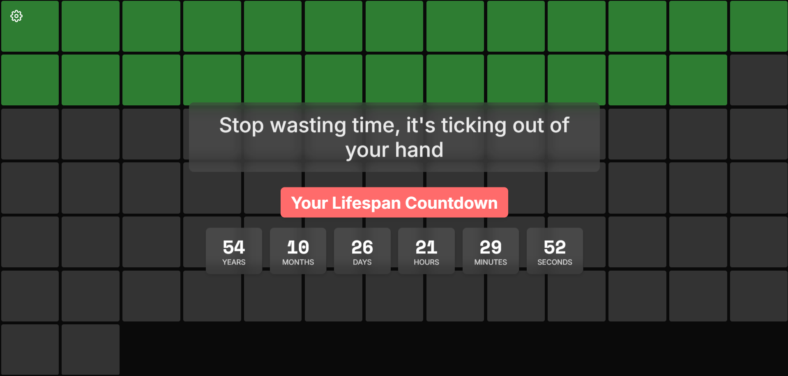
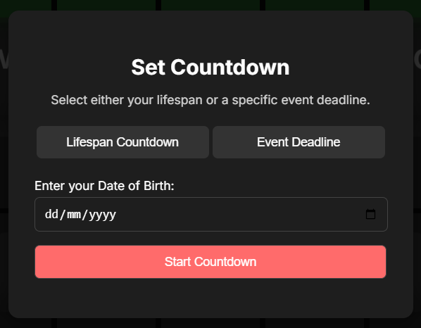
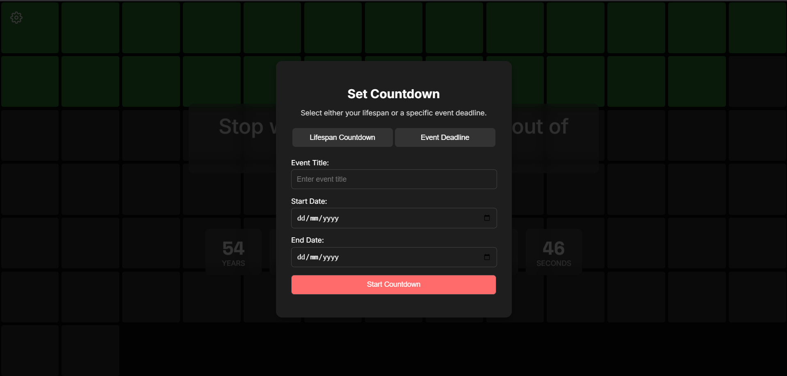

# Life Countdown Chrome Extension



A Chrome extension that visualizes your remaining time in a GitHub-style graph. Stay motivated and make every moment count! This project is heavily inspired by [Hitesh Choudhary's Life Countdown](https://chromewebstore.google.com/detail/life-countdown/afjhanbdjacdjfkllpbjdmgkgphoacdh).

---

## Features

- **Countdown Timer**: Visualize your remaining time in years, months, days, hours, minutes, and seconds.
- **GitHub-style Grid**: A grid of squares representing your time, inspired by GitHub's contribution graph.
- **Customizable Settings**: Set a countdown for your lifespan or a specific event.
- **Modern Design**: Clean and visually appealing UI with animations and emojis.

---

## Screenshots

### Countdown Timer


### Settings Modal



### Event Countdown

---

## Installation

### Step 1: Clone the Repository

```bash
git clone https://github.com/your-username/life-countdown.git
cd life-countdown
```

### Step 2: Load the Extension in Chrome

1. Open Chrome and go to `chrome://extensions/`.
2. Enable **Developer Mode** (toggle in the top-right corner).
3. Click **Load unpacked** and select the `life-countdown` folder.

---

## Usage

1. Open a new tab in Chrome.
2. Set your countdown by clicking the settings icon (☰) in the top-left corner.
   - Choose between **Lifespan Countdown** or **Event Deadline**.
   - Enter the required details and click **Start Countdown**.
3. Watch the grid update in real-time as time passes.

---

## Credits

This project is heavily inspired by [Hitesh Choudhary's Life Countdown](https://chromewebstore.google.com/detail/life-countdown/afjhanbdjacdjfkllpbjdmgkgphoacdh). Special thanks to Hitesh for the original idea and motivation.

---

## Contributing

Contributions are welcome! If you have any ideas, suggestions, or bug reports, please open an issue or submit a pull request.

---

Made with ❤️ by [Damruwan](https://damruwan.com/)
